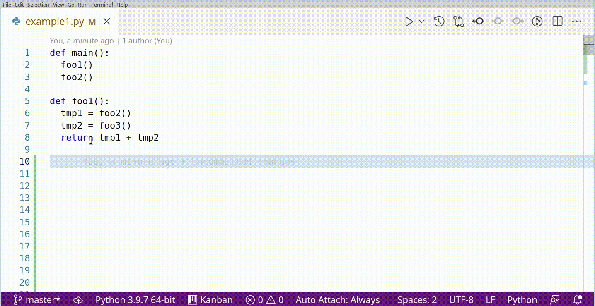

This is a VSCode extension to create dynamically growing diagrams. See the video below or [watch the Youtube video (2:20m)](https://youtu.be/CesCUSQTRLg) to get a grasp of what it does.

Install
========

From VSCode
------------
Install the extension [`Code Visualizer`](https://marketplace.visualstudio.com/items?itemName=visualprogrammingx.SourceCodeVisualizer)

From Release File
------------------
Menu → File → Preferences → Extensions → Three dots in the top corner → `Install from VSIX...`

How to use?
===========

## Activate

- Method 1:
  - Put the caret (cursor) on a function/class/namespace/whatever name
  - Right-click
  - Select `Visualize This`

- Method 2:
   - Put the caret (cursor) on a function/class/namespace/whatever name
   - Open VSCode commands (press `Ctrl`+`Shift`+`P`)
   - Search and select `Visualize This`

## Navigation

- View: zoom-in / zoom-out: `Alt`+`Scrolling`
- View: move around:
   - Drag&Drop the background
   - `Scroll` over background (vertical scroll)
   - `Shift`+`Scroll` over background (horizontal scroll)
- Open a definition: `doubleclick` an identifier

## Remarks

Don't change code while working within the diagram (this problem will be fixed in future versions)

Supported Languages
===================
Currently the following languages are supported:
- Python
- C/C++ (beware, due to VSCode's bad support for C/C++ you might experience difficulties)
- Php (experimental)
- Javascript (experimental)
- Typescript (experimental)
- Java (experimental)

Planned Features
=================
- Allow editing while viewing the diagram
- Enable multiple diagrams
- Save diagrams

Ackknowledgements
===================

- Ivan Sagalaev for [`highlightjs`](https://highlightjs.org/)
- Creators and maintainers of VSCode
- Creators and maintainers of nodejs

Development
============
See `README.md` in `src` directory
